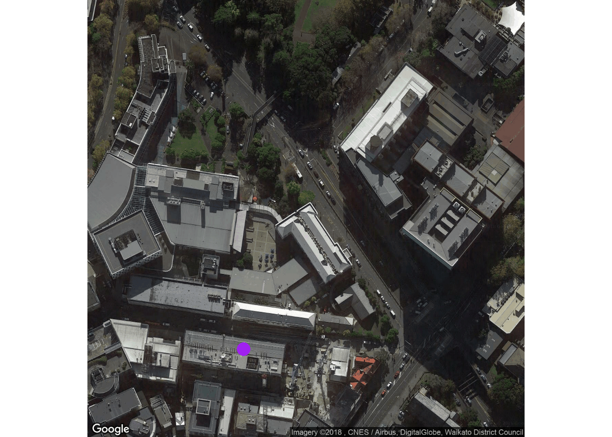

```{r setup, include=TRUE, echo=FALSE, results="hide"}
knitr::opts_chunk$set(echo = TRUE)
knitr::opts_chunk$set(out.width = "60%", message = FALSE)
knitr::opts_chunk$set(fig.path="")
```

```{r install_packages, eval=FALSE, echo=FALSE, results="hide"}
requiredPackages <- c("knitr",  "tidyverse",  "rgdal", "rgeos", 
                      "ggmap",  "tmap", "leaflet", "readxl", "readr", 
                      "ggplot2", "maps",  "maptools", "sp"
                    )

#packages_to_install <- requiredPackages[!(requiredPackages %in% installed.packages()[,1])]
#if(length(packages_to_install)>0 ) install.packages(packages_to_install, dependencies=TRUE)

# Load all packages
# lapply(requiredPackages, library, character.only=TRUE)
```

This tutorial demonstrates some key mapping functionality in R.


# tmap

## Introduction to `tmap`
The R package `tmap` provides an easy way of creating  "**t**hematic"
maps.


```{r tmap_tip}
library(tidyverse)
library(tmap)


# A great intro document
# vignette("tmap-getstarted")

#Get tips
tmap_tip()
```


There are a number of datasets provided within the tmap package. 
We will use the "world" data.
```{r, results="hide"}
data("World")
```

Inspect the output from the following code.
```{r, results="hide"}
str(World)
class(World)

# Specifies shape information for each row
World$geometry
```


The functions `tm_shape` and `tm_polygons` are used to create and colour a map.
```{r, eval=FALSE}
# Create a blank map
tm_shape(World) + tm_polygons()
```

```{r world_life_exp}
# Create a map, colour coded by life expectancy
tm_shape(World) + tm_polygons("life_exp")
```


Plots can be static or interactive
```{r world_life_exp2}
# Change mode to interactive "view"
tmap_mode("view") 
tm_shape(World) + tm_polygons("life_exp") 
```

```{r}
#To toggle between the modes
ttm()

#To switch back to static mode
tmap_mode("plot")
```

You can merge your own data with ```World``` and display it on the graph.  Here, we use random numbers to demonstrate the concept.
```{r world_rand}
World$rand <- rnorm(dim(World)[1],0,1)
tm_shape(World) + tm_polygons("rand", midpoint = NA)
```


## Adding layers to the plot

Multiple layers of data can be added to plots.

```{r}
data(World, metro, rivers, land)
```

Explore each part of the code separately to see its function.
```{r eval=FALSE}
tm_shape(land) + 
  tm_raster("elevation", palette = terrain.colors(10))
```

```{r eval=FALSE}
tm_shape(World) +
  tm_borders("white", lwd = .5) +
  tm_text("iso_a3", size = "AREA") 
```


```{r eval=FALSE}
tm_shape(metro) +
    tm_symbols(col = "red", size = "pop2020", scale = .5) 
```

These commands can be combined as follows. Notice how the layers get overlaid.
```{r world_elevations}
tm_shape(land) + 
  tm_raster("elevation", palette = terrain.colors(10)) +
tm_shape(World) +
  tm_borders("white", lwd = .5) +
  tm_text("iso_a3", size = "AREA") +
tm_shape(metro) +
    tm_symbols(col = "red", size = "pop2020", scale = .5) +
tm_legend(show = FALSE)
```


## Customising the map

Colours, titles and margins etc can be customised.

Options can also be set locally using ```tm_layout```.
```{r world_bluesea}
tm_shape(World) + tm_polygons("life_exp") +
tm_layout(bg.color = "skyblue", inner.margins = c(0, .02, .02, .02))
```

Options can also be set globally using ```tmap_options``` and ```tmap_style```.
```{r, eval=FALSE}
tmap_options(bg.color = "black", legend.text.color = "white")
tm_shape(World) + tm_polygons("life_exp")


tmap_style("classic")
tm_shape(World) + tm_polygons("life_exp")  
tmap_style("watercolor")
```


## Exporting maps
```{r, eval=FALSE}
tm <- tm_shape(World) + tm_polygons("life_exp")  

## save an image ("plot" mode)
tmap_save(tm, filename = "world_map.png")

## save as stand-alone HTML file ("view" mode)
tmap_save(tm, filename = "world_map.html")
```


## Exercises
Start from this plot:
```{r world_life_exp_starter}
tmap_mode("plot")
tm_shape(World) + tm_polygons("life_exp") 
```

* Use ```tm_layout``` to:
   + Add a title in the top right corner of the map
   + Add a title above the map
   + Change the background colour to a colour of your choice
* Add an option to ```tm_polygons``` to change the colour palette
* Change the style of the plot to "watercolor"


```{r}
rm(list=ls())
```


# ggmap


## Introduction to ```ggmap```
The package ggmap uses the conventions of ggplot2 and applies them to mapping.


Load the package. 
```{r}
library(ggmap)
```


In ggmap (and many other mapping packages), there are two step: 1) get the map data and 2) create the plot. The function qmap perfoms both steps at once.

## qmap
The function ```qmap``` (short for quick map) allows you to create a map very quickly.

```{r, eval=FALSE}
qmap(location="auckland")
```


We can be even more specific with our location.
The location string can be anything that you would type into google.

```{r, eval=FALSE}
qmap(location="AUT university", zoom=17, maptype = "satellite")
```


We will now add a marker our current location.  First 
we will get the coordinates of our current location with the ```geocode``` function.


```{r WZmap_setup}
wz <- "WZ building, AUT university"
wz_gc <- geocode(wz)
wz_gc
```

Now we will create a map.
```{r WZmap_setup2}
g <- qmap(location="AUT, NZ", maprange = TRUE, zoom=18,
          maptype = "satellite", 
          base_layer = ggplot(aes(x=lon, y=lat), data = wz_gc )) 
```

```{r WZmap, fig.show='hide'}
g + geom_point(colour="purple", size=5) 
```




Note: since these functions are querying google, there are some limitations
in terms of maximum queries per day (2500) and per second.
You may get an "OVER_QUERY_LIMIT" message. Waiting a few seconds should resolve the issue.  You can check your daily limit as follows. 

```{r}
geocodeQueryCheck()
```


  
## get_map and ggmap

The ```get_map``` function is a wrapper for assorted ```get_*``` functions. Once the map has been obtained using get_map, it can be plotted using ```ggmap```.

 
```{r, eval=FALSE}
m <- get_map(wz_gc, zoom=14)
g <- ggmap(m)
g
```


The ```get_map``` function allows different map sources.
```{r WZ_water_col_map}
m <- get_map(wz_gc, zoom=14, source = "stamen", maptype = "watercolor")
g <- ggmap(m)
g
```


```{r, eval=FALSE}
m <- get_map(wz_gc, zoom=14, source="google", maptype = "roadmap")
g <- ggmap(m)
g
```

Run the following code and notice how different "extent" options change the look of the map.
```{r, eval=FALSE}
ggmap(m, extent="device")
ggmap(m, extent="normal")
ggmap(m, extent="panel")
```


## Adding paths to a map

Paths (pairs of longitudes and latitudes) can be added to plots.
```{r WZ_path}
# Create a random path
set.seed(500)
df <- round(data.frame(
x = jitter(rep(wz_gc$lon, 10), amount = .01),
y = jitter(rep(wz_gc$lat, 10), amount = .01)
), digits = 3)

# Create the map
map <- get_googlemap("St Pauls street, Auckland", markers = df, path = df, scale = 2, zoom=14)

# Plot the map
f <- ggmap(map, extent = 'device')
f
```

Let us inspect the map object.
```{r}
str(map)
attr(map, "bb")
```


We can colour code by a third variable. 

First we load the data.
```{r}
# Dummy data
citywalk <- data.frame(
  lon = c(174.766, 174.767, 174.768, 174.769),
  lat = c(-36.853, -36.854, -36.855, -36.856),
  elevation = c(1,2,3,4)
)

```


Then we create the map.
```{r city_walk}
citymap <- get_map(location = c(mean(citywalk$lon), mean(citywalk$lat)), 
                   maptype = "roadmap", 
                   source = "google", 
                   zoom = 14)
ggmap(citymap) + 
  geom_path(data = citywalk, aes(color = elevation), size = 3, lineend = "round") + 
  scale_color_gradientn(colours = rainbow(7), breaks = seq(0, 200, by = 25))
```


## Exercises

* The file "route_210183.csv" contains a path around Auckland. Plot the path over an Auckland map and determine the  highest point on the map?
* Create a map of the North Island. Add a path between Auckland and Wellington, going via Taupo.


```{r}
rm(list=ls())
```


 
# Leaflet

The final R package we will explore is ```leaflet```.

```{r}
library(leaflet)
library(rgdal)
library(rgeos)
```

We can create a map of our current location.
```{r aut_leaflet}
aut <- data.frame(ID = c("AUT"),
                     x = c(174.7664924),
                     y = c(-36.8539873), 
                     group=NA)

m <- leaflet() %>%
     addTiles() %>% # Add default OpenStreetMap map tiles  
     setView(lng = aut$x, lat = aut$y, zoom = 15) 

m  # Print the map

```

Try these functions
```{r aut_leaflet2, results="hide"}
m %>% addMarkers(lng= aut$x, lat = aut$y, popup="WZ building") 

m  %>% addPopups(lng= aut$x, lat = aut$y, "Here is the <b>WZ building</b>, AUT")


rand_lng <- function(n = 10) rnorm(n, aut$x, .01)
rand_lat <- function(n = 10) rnorm(n, aut$y, .01)

# circle (units in metres)
m %>% addCircles(rand_lng(10), rand_lat(10), radius = runif(10, 50, 150))

# polyline
m %>% addPolylines(rand_lng(10), rand_lat(10))
```


```{r}
rm(list=ls())
```


# Solutions

## tmap
```{r tmap_sol}
library(tmap)
data("World")
tmap_mode("plot")
tmap_style("watercolor")
tm_shape(World) + tm_polygons("life_exp",  palette = "RdBu")   + 
  tm_layout(bg.color = "purple", title="A title", main.title="Another title")
```


##ggmap

```{r ggmap_sol_city_walk}
library(ggmap)
library(readr)
library(tidyverse)
citywalk <- read_csv("data/route_210183.csv", skip=1) # data from MapMyRun.com
citywalk <- dplyr::rename(citywalk, elevation=`elevation(meters)`)
citywalk$lat  <-as.numeric(citywalk$lat)
citymap <- get_map(location = c(mean(citywalk$lon), mean(citywalk$lat)), 
                   maptype = "roadmap", 
                   source = "google", 
                   zoom = 14)
ggmap(citymap) + 
  geom_path(data = citywalk, aes(color = elevation), size = 3, lineend = "round") + 
  scale_color_gradientn(colours = rainbow(7), breaks = seq(0, 200, by = 25))
```

```{r ggmap_sol_northisland}
locations <- data.frame(city = c("Auckland", "Taupo", "Wellington"), stringsAsFactors =FALSE)

# Get long & lat for locations
# Option 1: using geocode
# locations <- cbind(geocode(locations$city), locations)
# Option 2: using data from elsewhere
locations$lon <- c(174.7633, 176.0702, 174.7762)
locations$lat <- c(-36.84846, -38.68569, -41.28646)


summary(locations)

# Create the map
map <- get_googlemap("North Island, New Zealand", 
               markers = locations[,c("lon", "lat")], 
               path = locations[,c("lon", "lat")], 
               scale = 2, zoom=6)

# Plot the map
f <- ggmap(map)
f
```


# Resources


Good overview of mapping tools <https://cran.r-project.org/doc/contrib/intro-spatial-rl.pdf>

<https://rpubs.com/nickbearman/r-google-map-making>

Good introduction to the ggmap package  <http://stat405.had.co.nz/ggmap.pdf>  

More advanced information about geo-data <https://geocompr.robinlovelace.net/adv-map.html>


Useful overview of key R packages <https://www.computerworld.com/article/2921176/business-intelligence/great-r-packages-for-data-import-wrangling-visualization.html>


# Acknowledgements & References

* Rick Dalliessi, former student, provided initial Leaflet code

* Tennekes M (2018). “tmap: Thematic Maps in R.” _Journal of Statistical Software_, *84*(6), 1-39. doi:
<10.18637/jss.v084.i06 (URL: http://doi.org/10.18637/jss.v084.i06)>.

* D. Kahle and H. Wickham. ggmap: Spatial Visualization with ggplot2. The R Journal, 5(1), 144-161. URL
  <http://journal.r-project.org/archive/2013-1/kahle-wickham.pdf>

* Joe Cheng, Bhaskar Karambelkar and Yihui Xie (2018). leaflet: Create Interactive Web Maps with the JavaScript  'Leaflet' Library. R package version 2.0.1. <https://CRAN.R-project.org/package=leaflet>

