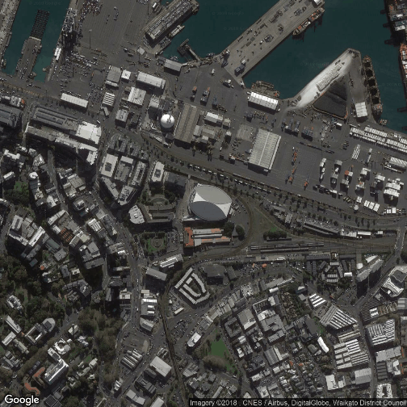
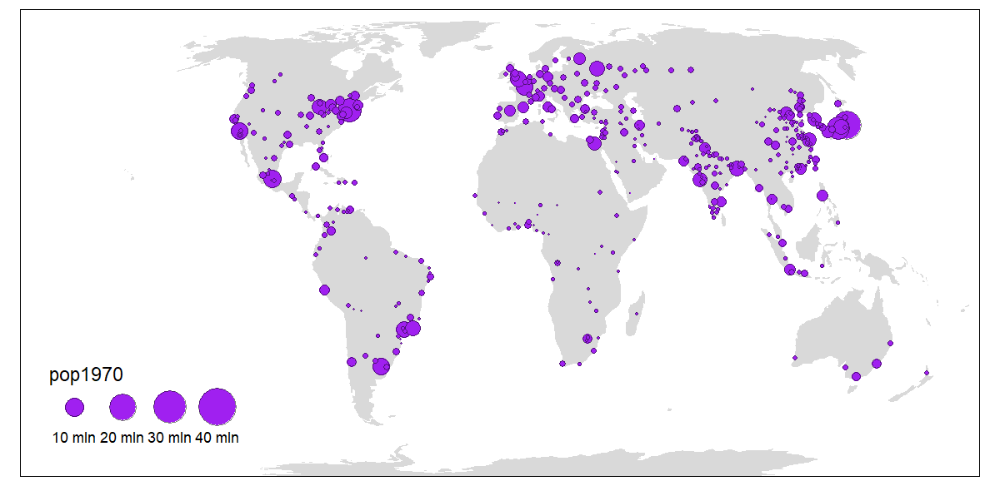
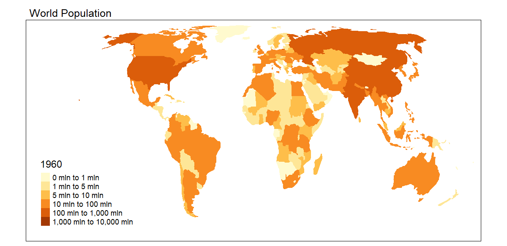

 

```{r setup,  include=FALSE}
knitr::opts_chunk$set(echo = FALSE, message=FALSE, warning=FALSE)
knitr::opts_chunk$set(fig.width=8,
                      #fig.height=4.5,
                      #dpi=300,
                      out.width="1200px",
                      #out.height="1200px",
                      fig.path="",
                      fig.align="center")

# Set to TRUE to make leaflet maps. Setting to FALSE speeds up compile time.
# Used in chunk optione  EVAL option
makeLeafletMaps <- TRUE
```

```{r, echo=FALSE, message=FALSE, warning=FALSE}
library(ggmap)
```

## Welcome to the R Ladies Meet Up: Creating Maps in R

* Wifi: Connect to **autwifi** (username and password on the white board)
* Download the zip file from github: <https://github.com/sarahemarshall/creating_maps>  
* Run session_prep.R to install the required R packages

 

## Overview

**Types of maps**

**R packages**

**Exercises**


## Can you guess what I did on Saturday night?

```{r spark, eval=FALSE, echo=FALSE, message=FALSE, warning=FALSE}
spark <- geocode("Spark Arena, Auckland")
g <- qmap(location="Spark Arena, Auckland", maprange = TRUE, zoom=16,
           maptype = "satellite", base_layer = ggplot(aes(x=lon, y=lat), 
                      data = spark )) 
g
```


R package:  ```ggmap```

## Can you guess what I did on Saturday night?

```{r pinkspark, eval=FALSE,echo=FALSE, message=FALSE, warning=FALSE}
g + geom_point(colour="hotpink", size=8) 
```


R package:  ```ggmap```

## World map

```{r pink_world1, echo=FALSE, message=FALSE, warning=FALSE}
pink_gc <- read.csv("data/pink_gc.csv")
pink_gc2 <- pink_gc
pink_gc2[pink_gc2$lon < 0, "lon"] <- pink_gc2$lon[pink_gc2$lon < 0]+360 

# Obtain world map data
WorldData <- map_data("world2")
w <- ggplot(WorldData, aes(x=long, y=lat, group = group)) +
  geom_polygon(colour = "black",  fill=NA) +
  coord_fixed(ratio=1.3)
w
```

R package:  ```ggplot2```

## World map without axes 

```{r pink_world2, echo=FALSE, message=FALSE, warning=FALSE}
w <- ggplot(WorldData, aes(x=long, y=lat, group = group)) +
  geom_polygon(colour = "black",  fill=NA) + 
  scale_y_continuous(breaks=c()) + 
  scale_x_continuous(breaks=c()) + 
  labs(x="", y="")+
  coord_fixed(ratio=1.3)
w 

```

R package:  ```ggplot2```

## World map: P!nk's Beautiful Trauma Tour

```{r pink_world3, echo=FALSE, message=FALSE, warning=FALSE}
w <- ggplot(WorldData, aes(x=long, y=lat, group = group)) +
  geom_polygon(colour = "black",  fill=NA) + 
  scale_y_continuous(breaks=c()) + 
  scale_x_continuous(breaks=c()) + 
  labs(title = "P!nk's World Tour", x="", y="") +
  theme(panel.border =  element_blank(),
        plot.title = element_text(colour = "hotpink"))

w +   geom_point(data = pink_gc2, aes(x = lon, y = lat, group=NULL),col="hotpink", size=2)+
  coord_fixed(ratio=1.3)
```

R package:  ```ggplot2```

## World map showing population by country


```{r world_life_exp, echo=FALSE}
library(tidyverse)
library(tmap)
data("World")
# Change mode to interactive "view"
# tmap_mode("view") 
tm_shape(World) + tm_polygons("life_exp",  palette = "Purples") 
```

R package:  ```tmap```

## World map showing population of cities 
```{r world_elevation, echo=FALSE}
data(World, metro, rivers, land)
tm_shape(land) + 
  tm_raster("elevation", palette = terrain.colors(10)) +
tm_shape(World) +
  tm_borders("white", lwd = .5) +
  tm_text("iso_a3", size = "AREA") +
tm_shape(metro) +
    tm_symbols(col = "red", size = "pop2020", scale = .5) +
tm_legend(show = FALSE)
```

R package:  ```tmap```


## World map showing population growth over time

```{r eval=FALSE, echo=FALSE}
data(World, metro)
# Animation requires https://www.imagemagick.org/

m2 <- tm_shape(World, simplify = 0.5) +
  tm_fill() +
  tm_shape(metro) + 
  tm_bubbles(size = paste0("pop", seq(1970, 2030, by=10)),
             col = "purple",
             border.col = "black", border.alpha = .5,
             scale = 2) +
  tm_facets(free.scales.symbol.size = FALSE, nrow=1,ncol=1) + 
  tm_format("World", scale=.5) 

tmap_animation(m2, filename="WorldPopulation.gif", width=1200, delay=100)

```


Adapted from <https://geocompr.robinlovelace.net/adv-map.html>

R package:  ```tmap```


## World map showing population growth over time
```{r, eval=FALSE, echo=FALSE}
library(readxl) 
library(rmapshaper)
# Animation requires https://www.imagemagick.org/

# Option 1: Download data manually 
world_popn_fname_local <-"data/API_SP.POP.TOTL_DS2_en_excel_v2_10080862.xls"

# Option 2: Download data within R
# world_popn_url <- "http://api.worldbank.org/v2/en/indicator/SP.POP.TOTL?downloadformat=excel"
# world_popn_fname_local <- "SP_POP.xls"  #Save excel file locally
# curl::curl_download(world_popn_url, world_popn_fname_local)

# Import data into R
SP_POP <- read_excel(world_popn_fname_local, sheet = "Data", skip = 3)
#View(SP_POP)

data("World")

# Country names can differ so we will add the 3 letter country code to the map data
World_full<- merge(World, SP_POP, by.x="iso_a3", by.y="Country Code", all.x=TRUE)

along_names <- paste0("X", seq(1960, 2017, by=1))
summary(World_full[,along_names])   

m2 <- tm_shape(World_full, simplify = 0.5) +
  tm_fill(col=along_names,title=sub("X", "", along_names),
          breaks=c(0, 1E6, 5E6, 1E7, 1E8, 1E9, 1E10)
          #, palette = "RdBu"
          ) +
  tm_facets(free.scales.symbol.size = FALSE, nrow=1,ncol=1) + 
  tm_format("World", scale=.5)   + 
  tm_layout(main.title="World Population", main.title.size = 0.5)

#m2
tmap_animation(m2, filename="WorldPopulationTime.gif", width=1200, delay=20, restart.delay = 100)
```



Data source: World Bank

R package:  ```tmap```


## NZ map 
```{r, echo=FALSE}
library(readxl)
library(leaflet)
library(rgdal)
library(rgeos)
```

```{r nzmap, echo=FALSE}
leaflet() %>% 
  addProviderTiles(providers$Esri.WorldImagery) %>%
  setView(lng = 174, lat = -41, zoom = 5) 
```

R package:  ```leaflet```


## Auckland map


```{r loadshape_data, eval=makeLeafletMaps, echo=FALSE, results="hide"}
# Data file webpage http://archive.stats.govt.nz/browse_for_stats/Maps_and_geography/Geographic-areas/digital-boundary-files.aspx
# Data file link http://www3.stats.govt.nz/digitalboundaries/annual/ESRI_Shapefile_2017_Digital_Boundaries_Generalised_Clipped.zip?_ga=2.106507014.446711510.1536620893-202953112.1470866239

fpath <- "data/AU2017_GV_Clipped.shp"


NZ_areaUnitShapes <- readOGR(dsn = fpath)  %>% 
   spTransform(CRS("+proj=longlat +datum=WGS84 +no_defs")) 

# Inspect the NZ_areaUnitShapes object
head(NZ_areaUnitShapes)
head(NZ_areaUnitShapes@data)
head(NZ_areaUnitShapes$AREA_SQ_KM)
object.size(NZ_areaUnitShapes)
```


```{r mergedata, eval=makeLeafletMaps, echo=FALSE, results="hide"}
#Note: 2017 shape files are used with 2013 census data.

#http://archive.stats.govt.nz/Census/2013-census/data-tables/meshblock-dataset.aspx
#download.file("http://www3.stats.govt.nz/meshblock/2013/excel/2013_mb_dataset_Auckland_Region.zip?_ga=2.73084054.446711510.1536620893-202953112.1470866239", destfile="Auckland_Region_census.zip")
#unzip("Auckland_Region_census.zip", exdir="2013_mb_dataset_Auckland_Region")
#fullpath <- data/2013_mb_dataset_Auckland_Region/2013-mb-dataset-Auckland-Region-household.xlsx", 


census_auckland_2013 <- read_excel("data/2013-mb-dataset-Auckland-Region-household.xlsx", 
                                   sheet = "2 Area unit", skip = 9, na="..C")

census_auckland_2013_subset<- census_auckland_2013 %>% select(AUC=X__1, AUD=X__2, N2001=X__3, N2006=X__4, N20013=X__5,
                             `Median household income 2001`  =`Median household income ($)(18)(23)`,
                             `Median household income 2006`  =`Median household income ($)(18)(23)__1`,
                             `Median household income 2013`  =`Median household income ($)(18)(23)__2`,
                             `Median weekly rent paid 2001`  =`Median Weekly Rent Paid ($)(16)(18)` , 
                             `Median weekly rent paid 2006`  =`Median Weekly Rent Paid ($)(16)(18)__1` , 
                             `Median weekly rent paid 2013`  =`Median Weekly Rent Paid ($)(16)(18)__2` 
) %>% na.omit()

 
# Merge shape data with census data
NZ_areaUnitShapes@data$medHIncome2013 <- merge(NZ_areaUnitShapes@data, census_auckland_2013_subset, by.x="AU2017", by.y="AUC", all.x=TRUE)[,"Median household income 2013"]

NZ_areaUnitShapes@data$medWRent2013 <- merge(NZ_areaUnitShapes@data, census_auckland_2013_subset, by.x="AU2017", by.y="AUC", all.x=TRUE)[,"Median weekly rent paid 2013"]

# Inspect data
summary(NZ_areaUnitShapes@data$medHIncome2013)
summary(NZ_areaUnitShapes@data$medWRent2013)
class(NZ_areaUnitShapes@data$medHIncome2013) #must be numeric 

auckland_areaUnitShapes <- NZ_areaUnitShapes %>% subset(AU2017 %in% census_auckland_2013_subset$AUC)
 


# Simplify shapes for faster plotting
auckland_small <- gSimplify(auckland_areaUnitShapes, tol=0.00001, topologyPreserve=TRUE)
# Re-attach data
auckland_small <- SpatialPolygonsDataFrame(auckland_small, data=auckland_areaUnitShapes@data)

# Compare object size
print(object.size(NZ_areaUnitShapes), units="auto")
print(object.size(auckland_areaUnitShapes), units="auto")
print(object.size(auckland_small), units="auto")
```

```{r auckland_map, eval=makeLeafletMaps, echo=FALSE}
incomeColors <- colorBin("BuPu", domain = c(0, 150000)
                         , bins = seq(0, 150000, length.out=6),
                         na.color = "#808080")

rentColors <- colorBin("BuPu", domain = c(0, 800)
                         , bins = seq(0, 800, length.out=6),
                         na.color = "#808080")


m <- leaflet(auckland_small) %>% 
  addProviderTiles(providers$Esri.WorldImagery) %>%
  setView(lng = 174.8, lat = -36.80, zoom = 9) 
m
```
Data source: Statistics New Zealand

R package:  ```leaflet```

## Auckland map with area units (from shape file)
```{r auckland_map_AU, eval=makeLeafletMaps}
m  %>% addPolygons()
```
Data source: Statistics New Zealand

R package:  ```leaflet```

## Auckland map with income and rent
```{r auckland_map_AU_income, echo=FALSE, eval=makeLeafletMaps}


income <- m  %>% addPolygons(fillColor=~incomeColors(medHIncome2013), color = "white", weight = 1, fillOpacity = 1) %>%   addLegend("bottomright", pal = incomeColors, values = auckland_small$medHIncome2013, 
             opacity = 1, title="Median Household Income")


rent <- m  %>% addPolygons(fillColor=~rentColors(medWRent2013), color = "white", weight = 1, fillOpacity = 1) %>%   addLegend("bottomright", pal = rentColors, values = auckland_small$medWRent2013, 
             opacity = 1, title="Median Weekly Rent Paid")

 
mapview::latticeView(income, rent, ncol = 2, sync = list(c(1, 2)), sync.cursor = FALSE, no.initial.sync = FALSE)

```

Data source: Statistics New Zealand
 
R package:  ```leaflet```

## Overview

**Types of maps**

**R packages**

* tmap
* ggmap
* ggplot
* leaflet

**Exercises**


## References &  Acknowledgements 


* Rick Dalliessi, former student, provided initial Leaflet code

* M. Tennekes (2018). “tmap: Thematic Maps in R.” _Journal of Statistical Software_, *84*(6), 1-39. doi:
<10.18637/jss.v084.i06 (URL: http://doi.org/10.18637/jss.v084.i06)>.

* D. Kahle and H. Wickham. ggmap: Spatial Visualization with ggplot2. The R Journal, 5(1), 144-161. URL
  <http://journal.r-project.org/archive/2013-1/kahle-wickham.pdf>

* Joe Cheng, Bhaskar Karambelkar and Yihui Xie (2018). leaflet: Create Interactive Web Maps with the JavaScript  'Leaflet' Library. R package version 2.0.1. <https://CRAN.R-project.org/package=leaflet>


## Resources
* Good overview of mapping tools <https://cran.r-project.org/doc/contrib/intro-spatial-rl.pdf>

* <https://rpubs.com/nickbearman/r-google-map-making>

* Good introduction to the ggmap package  <http://stat405.had.co.nz/ggmap.pdf>  

* More advanced information about geo-data <https://geocompr.robinlovelace.net/adv-map.html>


* Useful overview of key R packages <https://www.computerworld.com/article/2921176/business-intelligence/great-r-packages-for-data-import-wrangling-visualization.html>


